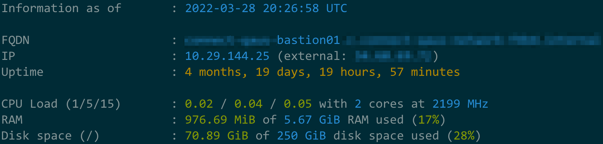

# Dynamotd

We know: servers, VMs and bare metals are not cool nowadays, but you may still have them and have to
take care of them, so how about making your life a little better?
 
This app provides a [MOTD (Message Of The Day)](https://en.wikipedia.org/wiki/Motd_(Unix)) optimized for 
providing the info about your server that YOU need to troubleshoot stuff when you SSH to it (because if you are doing
it, then something IS wrong with the server, isn't it?).   

## Features



* **Useful default info** - CPU Load, Memory use, Network use, Disk space use etc.,
* **Semantic colors** - for example red if load is higher than number of cores,
* **Customizable** - reorder and remove default lines,

## TODO

These features will be implemented in the future:

* **Pluggable** - add custom lines with any label and any command(s) output as the value,
* **Static and dynamic mode** - the former just prints the current state, the latter updates every 2 seconds,
  like htop,
* **Keyboard shortcuts** - to run popular tools (in dynamic mode only) like htop, iftop etc.
* **Fast** - written in Go for that,
* **Circuit-breaker** - minimal info mode in case of server overload detection,
* **Native packages for Centos and Ubuntu** - so you can easily install it on (almost) all of your servers.

We also don't have the tests yet and the building pipeline (but they WILL be created if we decide to go ahead with the project).

Finally, we don't have user docs, developer docs and contribution guide.

What we DO have is some non-idiomatic code and brain-dead solutions because the original author is only learning Golang.
:P

## Building

Requirements:
* Go v. 1.13+

How-to build:
```
go build ./...
```
